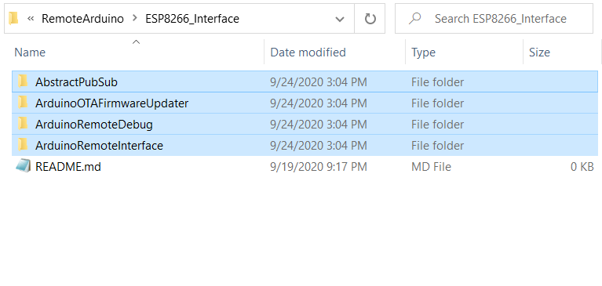
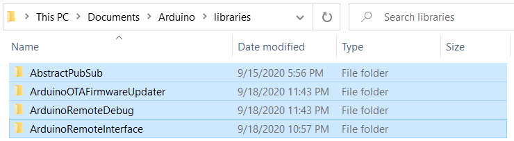

# Remote Arduino
_By Looi Kian Seong_

## Source Code Organisation
```
Repository
├── docs
├── ESP8266_Interface
│   ├──AbstractPubSub
│   ├──ArduinoOTAFirmwareUpdater
│   ├──ArduinoRemoteDebug
│   └──ArduinoRemoteInterface
└── Host
```

The `docs` folder contains the image(s) used for explanation. 

The `ESP8266_Interface` folder contains the libraries developed for ESP8266 WiFi module to interface with Arduino Uno
* **AbstractPubSub**: Defines an abstract class which contains some basic methods which will be implemented by child classes and a pure virtual method which will be defined and implemented by child classes. 
* **ArduinoOTAFirmwareUpdater**: Defines the class used for performing OTA firmware update on the connected Arduino Uno. 
* **ArduinoRemoteDebug**: Defines the class used for remote log debug messages from the connected Arduino Uno. 
* **ArduinoRemoteInterface**: Defines the class used for both OTA firmware update and remote debug log. 

The `Host` folder contains the Python script developed for the host machine to interface with the remote Arduino connected by ESP8266 WiFi module. 

## Circuit Connection


## Include the ESP8266 libraries for Arduino IDE
After cloning this repo, goes to `ESP8266_Interface` folder, manually copy all the folders in `ESP8266_Interface` to the Arduino libraries location. 
Guide to manual library installation can be found from this [link](https://www.arduino.cc/en/guide/libraries#toc5). 

  **Step 1: **
  
  
  
  **Step 2: **
  
  
